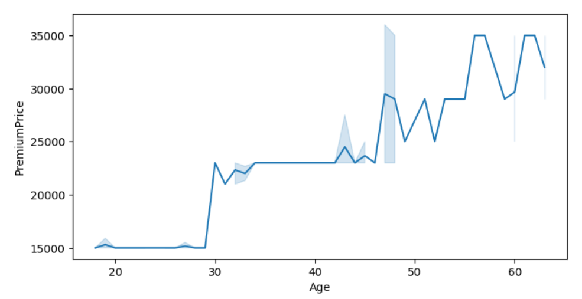

# Insurance cost prediction
 Problem Statement:  
 
Insurance companies need to accurately predict the cost of health insurance for individuals to
set premiums appropriately. However, traditional methods of cost prediction often rely on broad
actuarial tables and historical averages, which may not account for the nuanced differences
among individuals. By leveraging machine learning techniques, insurers can predict more
accurately the insurance costs tailored to individual profiles, leading to more competitive pricing
and better risk management

Data description:

1. Age: Numeric, ranging from 18 to 66 years.
2. Diabetes: Binary (0 or 1), where 1 indicates the presence of diabetes.
3. BloodPressureProblems: Binary (0 or 1), indicating the presence of blood
pressure-related issues.
4. AnyTransplants: Binary (0 or 1), where 1 indicates the person has had a transplant.
5. AnyChronicDiseases: Binary (0 or 1), indicating the presence of any chronic diseases.
6. Height: Numeric, measured in centimeters, ranging from 145 cm to 188 cm.
7. Weight: Numeric, measured in kilograms, ranging from 51 kg to 132 kg.
8. KnownAllergies: Binary (0 or 1), where 1 indicates known allergies.
9. HistoryOfCancerInFamily: Binary (0 or 1), indicating a family history of cancer.
10. NumberOfMajorSurgeries: Numeric, counting the number of major surgeries, ranging
from 0 to 3 surgeries.
11. PremiumPrice: Numeric, representing the premium price in currency, ranging from
15,000 to 40,000.

Initially, I analysed the impact of Age on premium.

