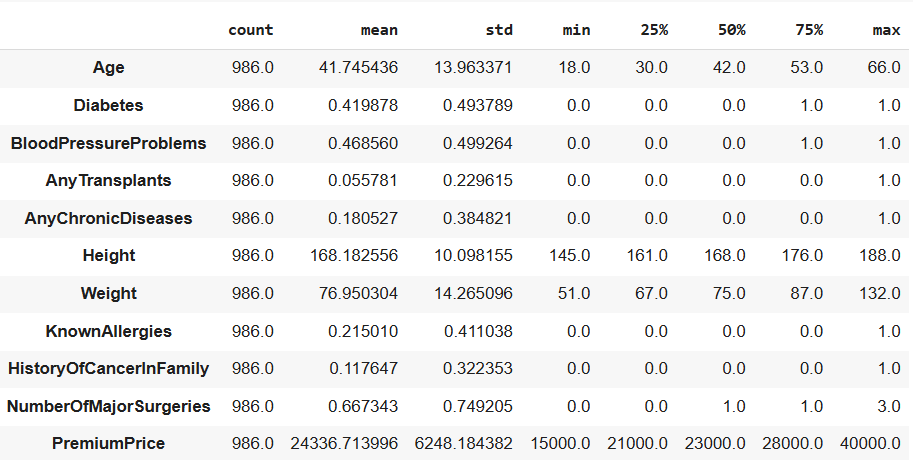
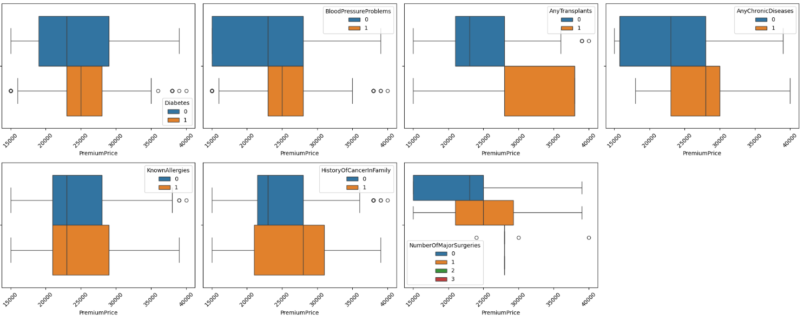
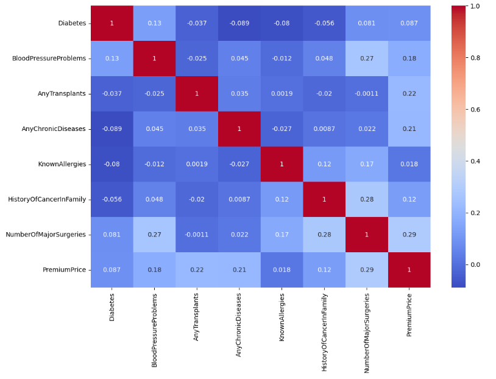
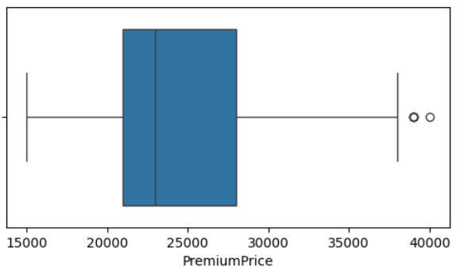
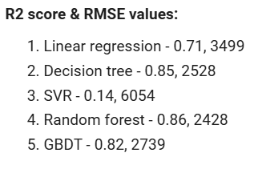
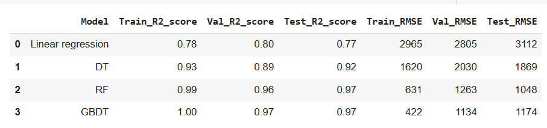
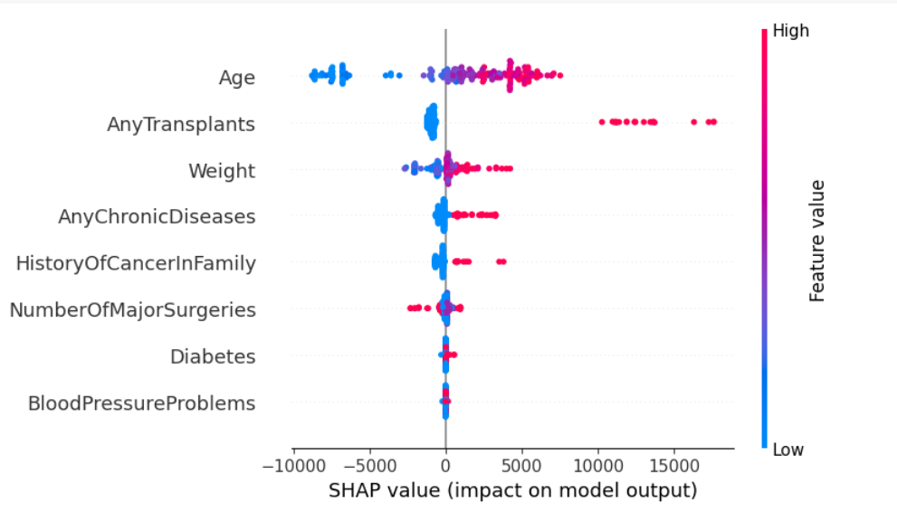
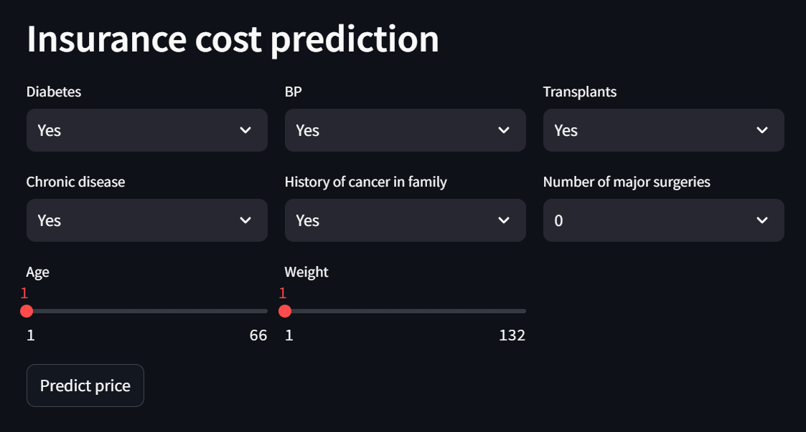

# Insurance cost prediction
 Problem Statement:  
 
Insurance companies need to accurately predict the cost of health insurance for individuals to
set premiums appropriately. However, traditional methods of cost prediction often rely on broad
actuarial tables and historical averages, which may not account for the nuanced differences
among individuals. By leveraging machine learning techniques, insurers can predict more
accurately the insurance costs tailored to individual profiles, leading to more competitive pricing
and better risk management

Data description:

1. Age: Numeric, ranging from 18 to 66 years.
2. Diabetes: Binary (0 or 1), where 1 indicates the presence of diabetes.
3. BloodPressureProblems: Binary (0 or 1), indicating the presence of blood
pressure-related issues.
4. AnyTransplants: Binary (0 or 1), where 1 indicates the person has had a transplant.
5. AnyChronicDiseases: Binary (0 or 1), indicating the presence of any chronic diseases.
6. Height: Numeric, measured in centimeters, ranging from 145 cm to 188 cm.
7. Weight: Numeric, measured in kilograms, ranging from 51 kg to 132 kg.
8. KnownAllergies: Binary (0 or 1), where 1 indicates known allergies.
9. HistoryOfCancerInFamily: Binary (0 or 1), indicating a family history of cancer.
10. NumberOfMajorSurgeries: Numeric, counting the number of major surgeries, ranging
from 0 to 3 surgeries.
11. PremiumPrice: Numeric, representing the premium price in currency, ranging from
15,000 to 40,000.

## Useful links:
 Insurance cost predictor: [Insurance price calculator](https://akashbana-insurance-cost-prediction-cost-prediction-5tfokx.streamlit.app/)     
 Medium article: [Medium article](https://medium.com/@crakashvk/insurance-cost-prediction-38ed13f37b01)         

First step to any project would be to understand the problem statement. As mentioned above, aim is to predict correct insurance cost for people - "Right product for right people at the right price"

Following steps are taken to build and deploy ML model:

1. EDA
2. Data pre-processing
3. Base model
4. Hypothesis testing
5. Feature engineering
6. Model building
7. Model evaluation
8. Model performance
9. SHAP
10. Model deployment on Streamlit application     

## EDA:   
   - General characterstics:   
     Mean age - 42 years   
     Mean height - 168 cms   
     Mean weight - 76 kgs   
     Mean premium - 24,336

 
     
   - They are 3 types of EDA:    
     i) Uni-variate analysis - Distribution of each feature    
     ii) Bi-variate analysis - Relationship between each feature and premium    
     iii) Multi-variate analysis - Relationship between 2 or more features & premium    

   Box plots for categorical features tell us an idea on how much people have paid with & without the presence of health conditions

   - Correlation of each feature with premium is calculated to understand how important each feature is for prediction   

   

Insights from EDA:

- There is a sharp jump in the premium from 16,000 for age range of 18 - 29 to around 24,000 for age range of 30 - 39. After the age of 40, premium varies between 28,000 to 30,000
- Around 40% of the people either have one of these: BP / Diabetes / 1 major surgery. Less than 10% of the people have 3 major surgeries / Transplants. Everything else falls in between
- 38% people had 1 major surgery, 12% people had 2 major surgeries & only 2% people had 3 major surgeries
- Age distribution seems uniform, which is ideal for analysis. People from all ages are present, so therefore, analysis based on age would give accurate results
- Around 70% people have bought premium less than 28,000, which is either 15,000 / 23,000 / 25,000 / 28,000
- Transplants / chronic diseases / No. of major surgeries / history of cancer in family --> Significant increase in premiums is seen with their presence
- Diabetes / BP --> increase in premiums ( comparativey lesser ) is seen with their presence
- Allergies --> No difference in premium is seen
- No missing values found
- Weight & premium columns have outliers
 
## Data pre-processing:
   - Data does not have any missing values
   - Outliers are found in: Weight & Premium, which are capped to 99th percentile

 

## Base Model:
   - Created base models without any feature engineering & cross validation just to understand how each model is performing
   - Tree based models are performing better
   - Base models are not performing well on test data, it is mainly because of inconsistant data where people with similar health conditions have paid different premiums
   - Following ML models are used:
     1. Linear regression
     2. Decision tree
     3. Random forest
     4. GBDT

 

## Hypothesis testing:
  - Various hypothesis tests have been carried out to understand the significance seen in the premiums

Insights:    
  - There is a significant difference in median premium values of each age group
  - There is a difference in average premium with the presence of Diabetes and without the presence of Diabetes
  - There is a difference in average premium with the presence of BloodPressureProblems and without the presence of BloodPressureProblems
  - There is a difference in average premium with the presence of AnyTransplants and without the presence of AnyTransplants
  - There is a difference in average premium with the presence of AnyChronicDiseases and without the presence of AnyChronicDiseases
  - There is no difference in average premium with & without the presence of KnownAllergies
  - There is a difference in average premium with the presence of HistoryOfCancerInFamily and without the presence of HistoryOfCancerInFamily
  - People with 0, 1, 2 or more major surgeries, each group has significantly different median premium values
  - Weight of the person which has 0.14 correlation coeff directly instead of BMI which has 0.1 correlation coeff
  - Presence of 2 diseases together increases the premium

## Feature engineering:
  - Data mainly contains a lot of outliers, which are treated based on age, weight & health conditions.

## Model building:
  - After treating outliers and using random search to find best hyper parameters for each model, following are the results on training, validation & test data

 

Model is performing really well with high R2 score and low RMSE. Model performance is not dropping on test data, which shows model is well generalized

## SHAP:
  - SHAP is used for interpretability of ML models, where in great detail we can study how each feature is contributing to final prediction

 

## Streamlit application:
  - Model is deployed on streamlit application

 
